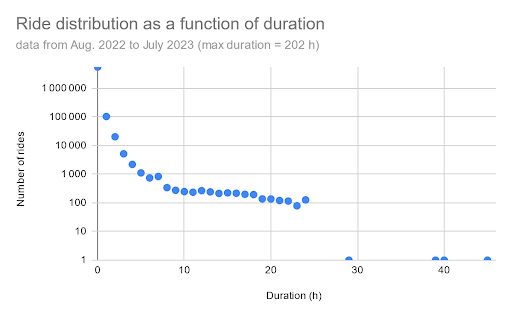
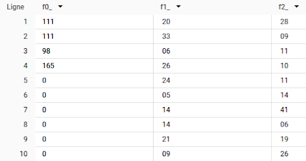
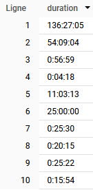

# Préparation des données
## Importation des données dans BigQuery

Chaque fichier correspond à un mois de données, organisées en 13 colonnes, chaque ligne correspondant à un trajet.

Pour chaque propriété, je définis les types de données suivants :


*NB : started_at et ended_at auraient aussi pu être déclarées en tant que TIMESTAMP au lieu de DATETIME.*

12 tables sont ainsi créées : `cyclistic_original_data.data_202208` à `cyclistic_original_data.data_202307`

## Rassemblement des données dans une table unique

Pour ne pas avoir à multiplier les étapes pour chaque mois, je regroupe toutes les données dans une unique table grâce à une instruction **UNION ALL** :

```sql
(
  SELECT *
  FROM cyclistic_original_data.data_202208
)
UNION ALL
(
  SELECT *
  FROM cyclistic_original_data.data_202209
)
UNION ALL
(
  SELECT *
  FROM cyclistic_original_data.data_202210
)
UNION ALL
(
  SELECT *
  FROM cyclistic_original_data.data_202211
)
UNION ALL
(
  SELECT *
  FROM cyclistic_original_data.data_202212
)
UNION ALL
(
  SELECT *
  FROM cyclistic_original_data.data_202301
)
UNION ALL
(
  SELECT *
  FROM cyclistic_original_data.data_202302
)
UNION ALL
(
  SELECT *
  FROM cyclistic_original_data.data_202303
)
UNION ALL
(
  SELECT *
  FROM cyclistic_original_data.data_202304
)
UNION ALL
(
  SELECT *
  FROM cyclistic_original_data.data_202305
)
UNION ALL
(
  SELECT *
  FROM cyclistic_original_data.data_202306
)
UNION ALL
(
  SELECT *
  FROM cyclistic_original_data.data_202307
)
```

Le résultat de la requête est enregistré dans une nouvelle table `cyclistic_merge_data.full_data`.


# Nettoyage des données

Dans cette opération, je vérifie l'absence de doublons ainsi que le contenu des différentes colonnes.

## Suppression des doublons
Je vérifie par une requête simple s'il existe des doublons :
```sql
SELECT
  COUNT(DISTINCT ride_id)
FROM cyclistic_merge_data.full_data
```
La requête retourne 5 723 606 ce qui est le nombre d'entrées dans la table : il n'y a donc pas de doublon à supprimer.

## Vérification du contenu des colonnes
### <ul><li>rideable_type</ul></li>
Trois types de vélos sont disponibles à la location : classique, électrique et cargo.
```sql
SELECT
  rideable_type AS bike_type,
  COUNT(rideable_type) AS n_of_rides
FROM
  cyclistic_merge_data.full_data
GROUP BY
  rideable_type
```


Le résultat de la requête est conforme (trois types de vélos) et il n'y a pas de valeurs nulles.

### <ul><li>started_at</ul></li>
```sql
SELECT
  COUNT(started_at) AS n_of_rides,
  MIN(started_at) AS first_ride,
  MAX(started_at) AS last_ride
FROM
  cyclistic_merge_data.full_data
WHERE
  started_at IS NOT NULL
```


Le nombre de trajets dont la date de départ existe correspond au nombre d’enregistrements dans la table. Le minimum et le maximum de la date de départ correspondent bien à la période étudiée (01/08/2022 - 31/07/2023).

### <ul><li>ended_at</ul></li>
```sql
SELECT
  COUNT(ended_at) AS n_of_rides,
  MIN(ended_at) AS first_ride,
  MAX(ended_at) AS last_ride
FROM
  cyclistic_merge_data.full_data
WHERE
  ended_at IS NOT NULL
```


Aucun enregistrement sans date de fin de location. Sur le dernier mois de location considéré, certains enregistrements se terminent au-delà du 31/07/2023 : cela concerne 162 enregistrements d’après la requête suivante.
```sql
SELECT
  COUNT(ended_at) AS n_of_rides
FROM
  cyclistic_merge_data.full_data
WHERE
  ended_at >= DATETIME("2023-08-01T00:00:00")
```


Il faut également vérifier que ended_at est cohérent chronologiquement avec started_at :
```sql
SELECT
  count(ride_id) AS anachronisms
FROM
  cyclistic_merge_data.full_data
WHERE
  ended_at <= started_at
```


715 enregistrements ne sont pas cohérents chronologiquement.
En fait, il y a parmi ces résultats une majorité de durées nulles :
```sql
SELECT
  count(ride_id) AS null_duration
FROM
  cyclistic_merge_data.full_data
WHERE
  ended_at = started_at
```


C’est assez surprenant car d'après ce qu'indique la source des données : _“The data has been processed to remove trips that are taken by staff as they service and inspect the system; and any trips that were below 60 seconds in length (potentially false starts or users trying to re-dock a bike to ensure it was secure).”_ De tels enregistrements avec une durée nulle ne devraient donc pas être présents.
Il faut donc supprimer ces entrées dans la table.

Par ailleurs, certains trajets semblent anormalement longs :
```sql
SELECT
  MAX(ended_at - started_at) AS longest_ride
FROM
  cyclistic_merge_data.full_data
```


Le trajet le plus long dans les données non-nettoyées a par exemple duré plus de 35 jours !
Il faut donc définir à partir de quel moment une location est considérée comme faussée, et quel nombre de trajets sont concernés par ces longues durées.

Je regarde donc dans la table cyclistic_clean_data.full_data la distribution des trajets en fonction du nombre d’heures de la location (pour des durées positives) :
```sql
SELECT
  CAST(SPLIT(duration,':')[0] AS INT64) as hours,
  COUNT(ride_id)
FROM
  cyclistic_clean_data.full_data
WHERE
  NOT CONTAINS_SUBSTR(duration, "-")
  AND duration != "0:00:00"
GROUP BY
  hours
ORDER BY
  hours DESC
```

<details>
<summary>Tableau du résultat de la requête</summary>
  
| hours | n_of_rides |
|---|---|
|202|1|
|185|1|
|137|1|
|81|1|
|80|1|
|63|1|
|54|1|
|45|1|
|40|1|
|39|1|
|29|1|
|24|127|
|23|79|
|22|116|
|21|121|
|20|137|
|19|138|
|18|195|
|17|199|
|16|218|
|15|224|
|14|214|
|13|242|
|12|267|
|11|236|
|10|248|
|9|276|
|8|341|
|7|835|
|6|745|
|5|1117|
|4|2213|
|3|5179|
|2|20483|
|1|104297|
|0|5578521|

</details>



On a alors deux options :
- supprimer les 11 trajets dont la durée est supérieure à 24 h (i.e. trajets pour lesquels n_of_rides = 1) en considérant qu’ils sont une anomalie,
- ou bien définir une durée limite à considérer, par exemple 8 h (en accord avec le tracé).

Je choisis de supprimer uniquement les 11 trajets considérés comme anomalies.

_NB : En situation réelle, il faudrait échanger avec les partenaires pour comprendre ce qui se cache réellement derrière ces durées élevées et convenir ensemble du critère de sélection de ces données._


### <ul><li>start_lat, start_lng</ul></li>
Il s'agit des coordonnées géographiques (latitude, longitude) des stations de départ.

_NB : Je choisis de ne considérer que les coordonnées géographiques des enregistrements (latitude, longitude) plutôt que les noms et identifiants des stations. Je verrai plus tard que ce n’était pas la bonne méthode étant donné que les coordonnées ne sont pas toutes renseignées avec le même degré de précision…_

```sql
SELECT
  COUNT(ride_id) AS rides_wo_start_coord
FROM
  cyclistic_merge_data.full_data
WHERE
  start_lat IS NULL or start_lng IS NULL
```


Tous les enregistrements possèdent des coordonnées de départ.

Vérification qu’il n’y a pas de valeurs anormales :
```sql
SELECT
  MIN(start_lat) AS start_lat_min,
  AVG(start_lat) AS start_lat_mean,
  MAX(start_lat) AS start_lat_max,
  MIN(start_lng) AS start_lng_min,
  AVG(start_lng) AS start_lng_mean,
  MAX(start_lng) AS start_lng_max
FROM
  cyclistic_merge_data.full_data
```


Les latitudes et les longitudes de départ sont cohérentes, pas de valeur à exclure.


### <ul><li>end_lat, end_lng</ul></li>
Ce sont les coordonnées géographiques des stations d'arrivée.
```sql
SELECT
  COUNT(ride_id) AS rides_wo_end_coord
FROM
  cyclistic_merge_data.full_data
WHERE
  end_lat IS NULL or end_lng IS NULL
```


6102 enregistrements ne contiennent pas de coordonnées d’arrivée.

Vérification qu’il n’y a pas de valeurs anormales :
```sql
SELECT
  MIN(end_lat) AS end_lat_min,
  AVG(end_lat) AS end_lat_mean,
  MAX(end_lat) AS end_lat_max,
  MIN(end_lng) AS end_lng_min,
  AVG(end_lng) AS end_lng_mean,
  MAX(end_lng) AS end_lng_max
FROM
  cyclistic_merge_data.full_data
```


Certaines coordonnées géographiques sont égales à 0, ce qui est incohérent d'un point de vue géographique.

Il est donc nécessaire de nettoyer les données. Je décide de supprimer les enregistrements ne contenant pas de valeurs correctes pour les latitude et longitude d’arrivée (valeurs NULL et égales à 0) car cela ne permettra pas de calculer les distances parcourues.

```sql
SELECT
  COUNT(ride_id) AS n
FROM
  cyclistic_merge_data.full_data
WHERE
  end_lat = 0
  OR end_lng = 0
  OR end_lat IS NULL
  OR end_lng IS NULL
```


Cela représente 6112 enregistrements à supprimer. Sur le nombre total d’enregistrements, c’est tout à fait négligeable.

Je vérifie que le fait de supprimer les valeurs de latitude ou longitude égales à 0 permet de supprimer toutes les valeurs anormales (d’un point de vue géographique) :

```sql
SELECT
  MIN(end_lat) AS end_lat_min,
  AVG(end_lat) AS end_lat_mean,
  MAX(end_lat) AS end_lat_max,
  MIN(end_lng) AS end_lng_min,
  AVG(end_lng) AS end_lng_mean,
  MAX(end_lng) AS end_lng_max
FROM
  cyclistic_merge_data.full_data
WHERE
  end_lat > 0
  AND end_lng < 0
```


Les valeurs sont désormais cohérentes géographiquement, il n’y a pas de valeurs supplémentaires à supprimer.


### <ul><li>member_casual</li></ul>
Il s'agit du type d'utilisateur : occasionnel ou abonné annuel.

```sql
SELECT
  member_casual AS customer,
  COUNT(ride_id) AS n_of_rides
FROM
  cyclistic_merge_data.full_data
GROUP BY
  member_casual
```


Il y a bien deux types d’utilisateurs dans la table, pas de valeurs nulles.


## Création d'une table contenant les données nettoyées
Sur la base des observations précédentes, je crée une table avec les données nettoyées. Je choisis de ne conserver que les données qui seront utiles à l’analyse :
- clé primaire : `ride_id`
- type de vélo : `rideable_type`
- date et heure du début de la location : `started_at`
- informations géographiques sur le trajet : `start_lat`, `start_lng`, `end_lat`, `end_lng`
- type d’utilisateur : `member_casual`

Je remplace la colonne ended_at par une colonne duration égale à la durée de la location. C’est complexe car les objets `TIME` ne peuvent excéder 24h. Il faut donc créer une string.

*Remarque a posteriori : j’aurais pu créer un objet* `INTERVAL` *qui peut ensuite être formaté à l’envie au moment de l’extraction des données pour leur analyse dans Google Sheets.*


### Travail sur une sous-requête pour le formatage d’un `INTERVAL`
Cet interval est issu de la différence `ended_at - started_at`.

**Requête avec sous-requête**
Pour récupérer les heures, minutes, secondes individuellement à partir de l’INTERVAL :

*NB : Dans cette requête, j’utilise* `CAST(minutes AS STRING FORMAT '00')` *pour que les minutes s’affichent toujours avec deux chiffres (e.g. 07).*

```sql
SELECT
  CAST(days*24+hours AS STRING),
  CAST(minutes AS STRING FORMAT '00'),
  CAST(seconds AS STRING FORMAT '00')
FROM(
  SELECT
    EXTRACT(DAY FROM ended_at-started_at) AS days,
    EXTRACT(HOUR FROM ended_at-started_at) AS hours,
    EXTRACT(MINUTE FROM ended_at - started_at) AS minutes,
    EXTRACT(SECOND FROM ended_at - started_at) AS seconds,
  FROM
    cyclistic_merge_data.full_data
  LIMIT 10
)
```


Les heures, minutes, secondes sont bien séparées et correctement formatées.

Pour maintenant en faire une `STRING` avec chaque valeur séparée par `:` comme on l’attend pour l’affichage d’une durée :

*NB : Le* `FORMAT '00'` ajoute un espace avant la valeur, j’utilise donc la fonction `TRIM` pour le supprimer `TRIM(CAST(minutes AS STRING FORMAT '00'))`

```sql
SELECT
  CONCAT(
  CAST(days*24+hours AS STRING),
  ":",
  TRIM(CAST(minutes AS STRING FORMAT '00')),
  ":",
  TRIM(CAST(seconds AS STRING FORMAT '00'))) AS duration
FROM(
  SELECT
    EXTRACT(DAY FROM ended_at-started_at) AS days,
    EXTRACT(HOUR FROM ended_at-started_at) AS hours,
    EXTRACT(MINUTE FROM ended_at - started_at) AS minutes,
    EXTRACT(SECOND FROM ended_at - started_at) AS seconds,
  FROM
    cyclistic_merge_data.full_data
  LIMIT 10
)
```


Le résultat est conforme au formatage attendu.


### Requête complète pour la création de la table des données nettoyées
Je peux maintenant créer la table des données nettoyées. Pour cela, j’ajoute un `JOIN` pour lier le résultat de la sous-requête précédente (qui génère une string duration) aux autres données.
Dans la clause `WHERE`, j’indique toutes les conditions qui sont nécessaires pour nettoyer les données, tel que cela a été identifié précédemment. Enfin, j’ordonne les données par date croissante :

```sql
SELECT
  full_data.ride_id,
  rideable_type,
  member_casual AS user_type,
  CAST(started_at AS TIMESTAMP) AS start_time,
  CONCAT(
    CAST(days*24+hours AS STRING),
    ":",
    TRIM(CAST(minutes AS STRING FORMAT '00')),
    ":",
    TRIM(CAST(seconds AS STRING FORMAT '00'))) AS duration,
  start_lat,
  start_lng,
  end_lat,
  end_lng,


FROM(
  SELECT
    ride_id,
    EXTRACT(DAY FROM ended_at - started_at) AS days,
    EXTRACT(HOUR FROM ended_at - started_at) AS hours,
    EXTRACT(MINUTE FROM ended_at - started_at) AS minutes,
    EXTRACT(SECOND FROM ended_at - started_at) AS seconds,
  FROM
    cyclistic_merge_data.full_data
) AS time_data


JOIN
  cyclistic_merge_data.full_data AS full_data
ON full_data.ride_id = time_data.ride_id


WHERE
  end_lat > 0
  AND end_lng < 0
  AND ended_at > started_at
  AND ended_at - started_at <= MAKE_INTERVAL(0, 0, 1, 1, 0, 0) # 1 day + 1 hour
ORDER BY
  start_time
```

Il reste 5 716 768 entrées dans la table. Je sauvegarde le résultat de cette requête sous forme d’une nouvelle table nommée `cyclistic_clean_data.clean_data`.


