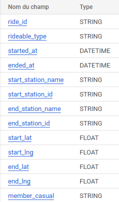
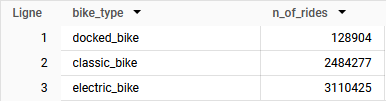

# Préparation des données
## Importation des données dans BigQuery

Chaque fichier correspond à un mois de données, organisées en 13 colonnes, chaque ligne correspondant à un trajet.

Pour chaque propriété, je définis les types de données suivants :



*NB : started_at et ended_at auraient aussi pu être déclarées en tant que TIMESTAMP au lieu de DATETIME.*

12 tables sont ainsi créées : `cyclistic_original_data.data_202208` à `cyclistic_original_data.data_202307`

## Rassemblement des données dans une table unique

Pour ne pas avoir à multiplier les étapes pour chaque mois, je regroupe toutes les données dans une unique table grâce à une instruction **UNION ALL** :

```sql
(
  SELECT *
  FROM cyclistic_original_data.data_202208
)
UNION ALL
(
  SELECT *
  FROM cyclistic_original_data.data_202209
)
UNION ALL
(
  SELECT *
  FROM cyclistic_original_data.data_202210
)
UNION ALL
(
  SELECT *
  FROM cyclistic_original_data.data_202211
)
UNION ALL
(
  SELECT *
  FROM cyclistic_original_data.data_202212
)
UNION ALL
(
  SELECT *
  FROM cyclistic_original_data.data_202301
)
UNION ALL
(
  SELECT *
  FROM cyclistic_original_data.data_202302
)
UNION ALL
(
  SELECT *
  FROM cyclistic_original_data.data_202303
)
UNION ALL
(
  SELECT *
  FROM cyclistic_original_data.data_202304
)
UNION ALL
(
  SELECT *
  FROM cyclistic_original_data.data_202305
)
UNION ALL
(
  SELECT *
  FROM cyclistic_original_data.data_202306
)
UNION ALL
(
  SELECT *
  FROM cyclistic_original_data.data_202307
)
```

Le résultat de la requête est enregistré dans une nouvelle table `cyclistic_merge_data.full_data`.


# Nettoyage des données

Dans cette opération, je vérifie l'absence de doublons ainsi que le contenu des différentes colonnes.

## Suppression des doublons
Je vérifie par une requête simple s'il existe des doublons :
```sql
SELECT
  COUNT(DISTINCT ride_id)
FROM cyclistic_merge_data.full_data
```
La requête retourne 5 723 606 ce qui est le nombre d'entrées dans la table : il n'y a donc pas de doublon à supprimer.

## Vérification du contenu des colonnes
### rideable_type
Trois types de vélos sont disponibles à la location : classique, électrique et cargo.
```sql
SELECT
  rideable_type AS bike_type,
  COUNT(rideable_type) AS n_of_rides
FROM
  cyclistic_merge_data.full_data
GROUP BY
  rideable_type
```


Le résultat de la requête est conforme (trois types de vélos) et il n'y a pas de valeurs nulles.


