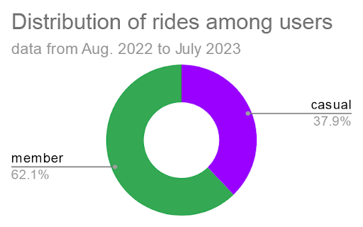

# Exploratory Data Analysis

Maintenant que les données sont rassemblées dans une table et nettoyées, on peut commencer l'exploration. L'objectif est d'identifier les différences de comportement entre les membres (abonnés annuels) et les utilisateurs occasionnels.

## Aggrégation et exportation des données
Je décide d’agréger les données par type d’utilisateur, type de vélo, mois, jour de la semaine. Cela me permettra d’identifier d’éventuelles tendances au cours d’une semaine, au cours de l’année, et d’évaluer si l’utilisation par les abonnés annuels diffère de celle des utilisateurs occasionnels. Je complète les données en calculant la durée et la distance des trajets.
En partant de la table `cyclistic_clean_data.clean_data`, j’exécute donc la requête suivante :
```sql
SELECT
  user_type,
  rideable_type,
  EXTRACT(MONTH FROM start_time) AS month,
  EXTRACT(DAYOFWEEK FROM start_time) AS day,
  COUNT(EXTRACT(DAYOFWEEK FROM start_time)) AS n_of_rides,
  ROUND(AVG(
    CAST(SPLIT(duration, ':')[0] AS INT64) * 3600
    + CAST(SPLIT(duration, ':')[1] AS INT64) * 60
    + CAST(SPLIT(duration, ':')[2] AS INT64)
    ), 3) AS mean_duration_s,
  ROUND(AVG(
    ST_DISTANCE(
      ST_GEOGPOINT(start_lng, start_lat),
      ST_GEOGPOINT(end_lng, end_lat))
    ), 1) AS mean_distance_m
FROM
  cyclistic_clean_data.clean_data
GROUP BY
  user_type,
  rideable_type,
  month,
  day
ORDER BY
  user_type,
  rideable_type,
  month,
  day
```
J'exporte les résultats de cette requête en CSV pour les étudier dans Sheets.


## Généralités sur l'utilisation des vélos
5 716 768 trajets ont été effectués entre août 2022 et juillet 2023.

### <ul><li>Utilisateurs</ul></li>
On peut regarder la répartition des trajets selon le type d'utilisateurs :



Près de 40% des trajets sont effectués par des utilisateurs occasionnels. Il y a donc une marge d’évolution considérable pour fédérer de nouveaux abonnés annuels.

### <ul><li>Type de vélos</ul></li>

Pour chaque catégorie d’utilisateurs, on peut regarder l’utilisation des différents types de vélos.


Ce sont majoritairement les vélos électriques qui sont utilisés chez les utilisateurs occasionnels. Ces utilisateurs sont également les seuls à utiliser des vélos cargo (“docked bike”). *NB : Peut-être que ces vélos ne sont pas ouverts à la location dans le cadre de l’abonnement annuel, ce qui expliquerait l’absence totale de vélos cargo utilisés par les abonnés.*

Pour les abonnés annuels, l’utilisation est plus équilibrée entre vélos électriques et classiques, mais avec néanmoins une légère avance pour les vélos électriques.


## Tendances selon les jours de la semaine
### <ul><li>Nombre de trajets</ul></li>

Je rajoute dans la table deux colonnes pour afficher les noms de jours de la semaine et des mois de l’année, grâce à `VLOOKUP` :
- je crée une nouvelle feuille `days month for VLOOKUP`
- pour extraire les noms des mois : `= VLOOKUP(C2, 'days month for VLOOKUP'!C:D, 2)`
- pour extraire les noms des jours : `=VLOOKUP(D2, 'days month for VLOOKUP'!A:B, 2)`

Je crée ensuite un tableau croisé dynamique avec `user_type` et `rideable_type` en Lignes, `day_id` et `day` en Colonnes, et `n_of_rides` en Valeurs.

*NB :* `day_id` *et* `day` *sont nécessaires si on veut pouvoir afficher les jours de la semaine dans l’ordre (*`day_id` *étant ajouté en premier, c’est lui qui prime pour l’ordre, et* `day` *permet d’afficher le nom du jour correspondant).*

