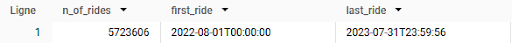
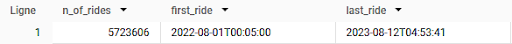
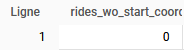
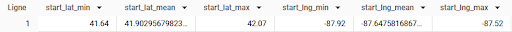
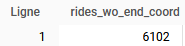
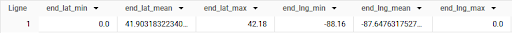
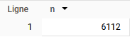
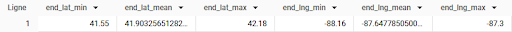
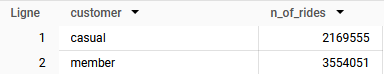

# Préparation des données
## Importation des données dans BigQuery

Chaque fichier correspond à un mois de données, organisées en 13 colonnes, chaque ligne correspondant à un trajet.

Pour chaque propriété, je définis les types de données suivants :


*NB : started_at et ended_at auraient aussi pu être déclarées en tant que TIMESTAMP au lieu de DATETIME.*

12 tables sont ainsi créées : `cyclistic_original_data.data_202208` à `cyclistic_original_data.data_202307`

## Rassemblement des données dans une table unique

Pour ne pas avoir à multiplier les étapes pour chaque mois, je regroupe toutes les données dans une unique table grâce à une instruction **UNION ALL** :

```sql
(
  SELECT *
  FROM cyclistic_original_data.data_202208
)
UNION ALL
(
  SELECT *
  FROM cyclistic_original_data.data_202209
)
UNION ALL
(
  SELECT *
  FROM cyclistic_original_data.data_202210
)
UNION ALL
(
  SELECT *
  FROM cyclistic_original_data.data_202211
)
UNION ALL
(
  SELECT *
  FROM cyclistic_original_data.data_202212
)
UNION ALL
(
  SELECT *
  FROM cyclistic_original_data.data_202301
)
UNION ALL
(
  SELECT *
  FROM cyclistic_original_data.data_202302
)
UNION ALL
(
  SELECT *
  FROM cyclistic_original_data.data_202303
)
UNION ALL
(
  SELECT *
  FROM cyclistic_original_data.data_202304
)
UNION ALL
(
  SELECT *
  FROM cyclistic_original_data.data_202305
)
UNION ALL
(
  SELECT *
  FROM cyclistic_original_data.data_202306
)
UNION ALL
(
  SELECT *
  FROM cyclistic_original_data.data_202307
)
```

Le résultat de la requête est enregistré dans une nouvelle table `cyclistic_merge_data.full_data`.


# Nettoyage des données

Dans cette opération, je vérifie l'absence de doublons ainsi que le contenu des différentes colonnes.

## Suppression des doublons
Je vérifie par une requête simple s'il existe des doublons :
```sql
SELECT
  COUNT(DISTINCT ride_id)
FROM cyclistic_merge_data.full_data
```
La requête retourne 5 723 606 ce qui est le nombre d'entrées dans la table : il n'y a donc pas de doublon à supprimer.

## Vérification du contenu des colonnes
### rideable_type
Trois types de vélos sont disponibles à la location : classique, électrique et cargo.
```sql
SELECT
  rideable_type AS bike_type,
  COUNT(rideable_type) AS n_of_rides
FROM
  cyclistic_merge_data.full_data
GROUP BY
  rideable_type
```


Le résultat de la requête est conforme (trois types de vélos) et il n'y a pas de valeurs nulles.

### started_at
```sql
SELECT
  COUNT(started_at) AS n_of_rides,
  MIN(started_at) AS first_ride,
  MAX(started_at) AS last_ride
FROM
  cyclistic_merge_data.full_data
WHERE
  started_at IS NOT NULL
```


Le nombre de trajets dont la date de départ existe correspond au nombre d’enregistrements dans la table. Le minimum et le maximum de la date de départ correspondent bien à la période étudiée (01/08/2022 - 31/07/2023).

### ended_at
```sql
SELECT
  COUNT(ended_at) AS n_of_rides,
  MIN(ended_at) AS first_ride,
  MAX(ended_at) AS last_ride
FROM
  cyclistic_merge_data.full_data
WHERE
  ended_at IS NOT NULL
```



Aucun enregistrement sans date de fin de location. Sur le dernier mois de location considéré, certains enregistrements se terminent au-delà du 31/07/2023 : cela concerne 162 enregistrements d’après la requête suivante.
```sql
SELECT
  COUNT(ended_at) AS n_of_rides
FROM
  cyclistic_merge_data.full_data
WHERE
  ended_at >= DATETIME("2023-08-01T00:00:00")
```


Il faut également vérifier que ended_at est cohérent chronologiquement avec started_at :
```sql
SELECT
  count(ride_id) AS anachronisms
FROM
  cyclistic_merge_data.full_data
WHERE
  ended_at <= started_at
```


715 enregistrements ne sont pas cohérents chronologiquement.
En fait, il y a parmi ces résultats une majorité de durées nulles :
```sql
SELECT
  count(ride_id) AS null_duration
FROM
  cyclistic_merge_data.full_data
WHERE
  ended_at = started_at
```


C’est assez surprenant car d'après ce qu'indique la source des données : _“The data has been processed to remove trips that are taken by staff as they service and inspect the system; and any trips that were below 60 seconds in length (potentially false starts or users trying to re-dock a bike to ensure it was secure).”_ De tels enregistrements avec une durée nulle ne devraient donc pas être présents.
Il faut donc supprimer ces entrées dans la table.

Par ailleurs, certains trajets semblent anormalement longs :
```sql
SELECT
  MAX(ended_at - started_at) AS longest_ride
FROM
  cyclistic_merge_data.full_data
```


Le trajet le plus long dans les données non-nettoyées a par exemple duré plus de 35 jours !
Il faut donc définir à partir de quel moment une location est considérée comme faussée, et quel nombre de trajets sont concernés par ces longues durées.

Je regarde donc dans la table cyclistic_clean_data.full_data la distribution des trajets en fonction du nombre d’heures de la location (pour des durées positives) :
```sql
SELECT
  CAST(SPLIT(duration,':')[0] AS INT64) as hours,
  COUNT(ride_id)
FROM
  cyclistic_clean_data.full_data
WHERE
  NOT CONTAINS_SUBSTR(duration, "-")
  AND duration != "0:00:00"
GROUP BY
  hours
ORDER BY
  hours DESC
```

<details>
<summary>Tableau du résultat de la requête</summary>
  
| hours | n_of_rides |
|---|---|
|202|1|
|185|1|
|137|1|
|81|1|
|80|1|
|63|1|
|54|1|
|45|1|
|40|1|
|39|1|
|29|1|
|24|127|
|23|79|
|22|116|
|21|121|
|20|137|
|19|138|
|18|195|
|17|199|
|16|218|
|15|224|
|14|214|
|13|242|
|12|267|
|11|236|
|10|248|
|9|276|
|8|341|
|7|835|
|6|745|
|5|1117|
|4|2213|
|3|5179|
|2|20483|
|1|104297|
|0|5578521|

</details>


On a alors deux options :
- supprimer les 11 trajets dont la durée est supérieure à 24 h (i.e. trajets pour lesquels n_of_rides = 1) en considérant qu’ils sont une anomalie,
- ou bien définir une durée limite à considérer, par exemple 8 h (en accord avec le tracé).

Je choisis de supprimer uniquement les 11 trajets considérés comme anomalies.

_NB : En situation réelle, il faudrait échanger avec les partenaires pour comprendre ce qui se cache réellement derrière ces durées élevées et convenir ensemble du critère de sélection de ces données._


### start_lat, start_lng
Il s'agit des coordonnées géographiques (latitude, longitude) des stations de départ.

_NB : Je choisis de ne considérer que les coordonnées géographiques des enregistrements (latitude, longitude) plutôt que les noms et identifiants des stations. Je verrai plus tard que ce n’était pas la bonne méthode étant donné que les coordonnées ne sont pas toutes renseignées avec le même degré de précision…_

```sql
SELECT
  COUNT(ride_id) AS rides_wo_start_coord
FROM
  cyclistic_merge_data.full_data
WHERE
  start_lat IS NULL or start_lng IS NULL
```


Tous les enregistrements possèdent des coordonnées de départ.

Vérification qu’il n’y a pas de valeurs anormales :
```sql
SELECT
  MIN(start_lat) AS start_lat_min,
  AVG(start_lat) AS start_lat_mean,
  MAX(start_lat) AS start_lat_max,
  MIN(start_lng) AS start_lng_min,
  AVG(start_lng) AS start_lng_mean,
  MAX(start_lng) AS start_lng_max
FROM
  cyclistic_merge_data.full_data
```

Les latitudes et les longitudes de départ sont cohérentes, pas de valeur à exclure.


### end_lat, end_lng
Ce sont les coordonnées géographiques des stations d'arrivée.
```sql
SELECT
  COUNT(ride_id) AS rides_wo_end_coord
FROM
  cyclistic_merge_data.full_data
WHERE
  end_lat IS NULL or end_lng IS NULL
```


6102 enregistrements ne contiennent pas de coordonnées d’arrivée.

Vérification qu’il n’y a pas de valeurs anormales :
```sql
SELECT
  MIN(end_lat) AS end_lat_min,
  AVG(end_lat) AS end_lat_mean,
  MAX(end_lat) AS end_lat_max,
  MIN(end_lng) AS end_lng_min,
  AVG(end_lng) AS end_lng_mean,
  MAX(end_lng) AS end_lng_max
FROM
  cyclistic_merge_data.full_data
```


Certaines coordonnées géographiques sont égales à 0, ce qui est incohérent d'un point de vue géographique.

Il est donc nécessaire de nettoyer les données. Je décide de supprimer les enregistrements ne contenant pas de valeurs correctes pour les latitude et longitude d’arrivée (valeurs NULL et égales à 0) car cela ne permettra pas de calculer les distances parcourues.

```sql
SELECT
  COUNT(ride_id) AS n
FROM
  cyclistic_merge_data.full_data
WHERE
  end_lat = 0
  OR end_lng = 0
  OR end_lat IS NULL
  OR end_lng IS NULL
```


Cela représente 6112 enregistrements à supprimer. Sur le nombre total d’enregistrements, c’est tout à fait négligeable.

Je vérifie que le fait de supprimer les valeurs de latitude ou longitude égales à 0 permet de supprimer toutes les valeurs anormales (d’un point de vue géographique) :

```sql
SELECT
  MIN(end_lat) AS end_lat_min,
  AVG(end_lat) AS end_lat_mean,
  MAX(end_lat) AS end_lat_max,
  MIN(end_lng) AS end_lng_min,
  AVG(end_lng) AS end_lng_mean,
  MAX(end_lng) AS end_lng_max
FROM
  cyclistic_merge_data.full_data
WHERE
  end_lat > 0
  AND end_lng < 0
```


Les valeurs sont désormais cohérentes géographiquement, il n’y a pas de valeurs supplémentaires à supprimer.


### member_casual
Il s'agit du type d'utilisateur : occasionnel ou abonné annuel.

```sql
SELECT
  member_casual AS customer,
  COUNT(ride_id) AS n_of_rides
FROM
  cyclistic_merge_data.full_data
GROUP BY
  member_casual
```


Il y a bien deux types d’utilisateurs dans la table, pas de valeurs nulles.


