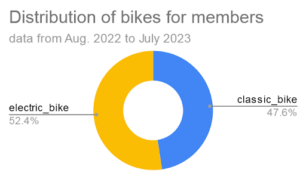
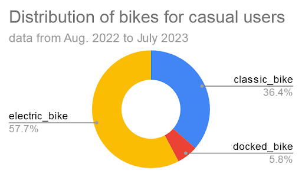
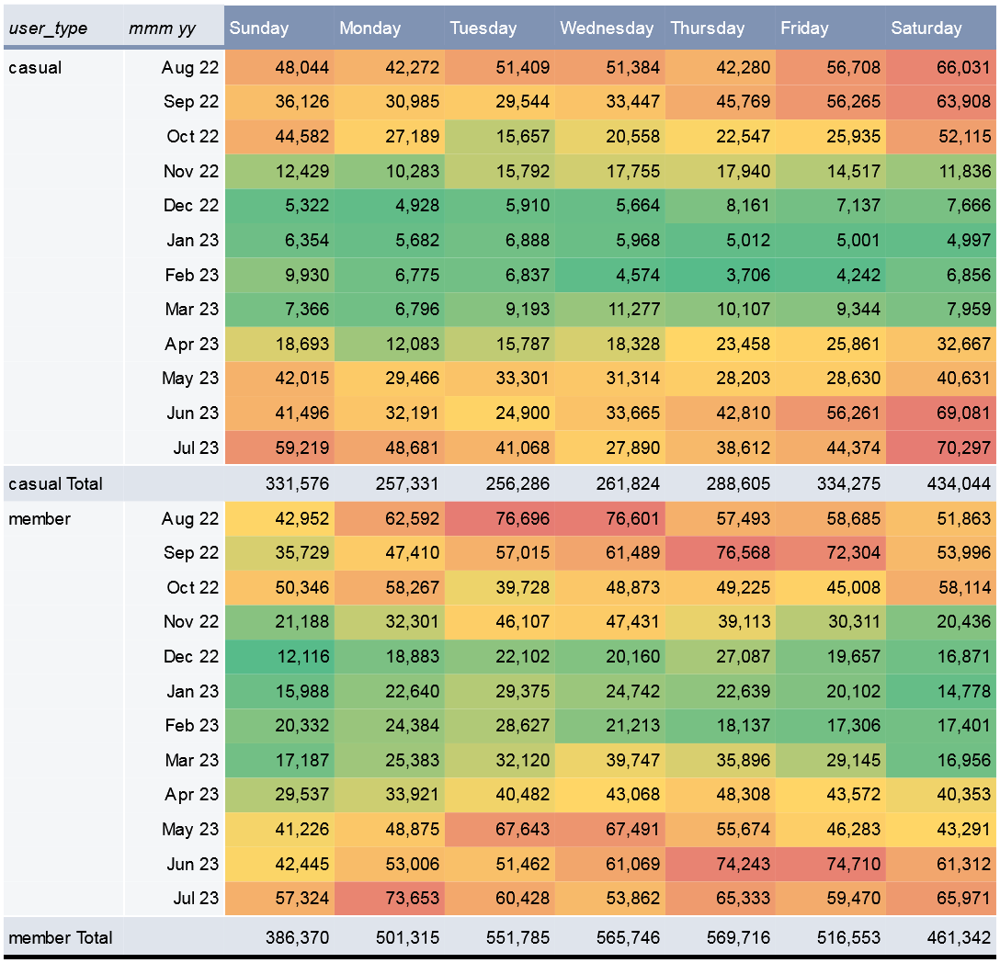

# Exploratory Data Analysis

Maintenant que les données sont rassemblées dans une table et nettoyées, on peut commencer l'exploration. L'objectif est d'identifier les différences de comportement entre les membres (abonnés annuels) et les utilisateurs occasionnels.

## Aggrégation et exportation des données
Je décide d’agréger les données par type d’utilisateur, type de vélo, mois, jour de la semaine. Cela me permettra d’identifier d’éventuelles tendances au cours d’une semaine, au cours de l’année, et d’évaluer si l’utilisation par les abonnés annuels diffère de celle des utilisateurs occasionnels. Je complète les données en calculant la durée et la distance des trajets.
En partant de la table `cyclistic_clean_data.clean_data`, j’exécute donc la requête suivante :
```sql
SELECT
  user_type,
  rideable_type,
  EXTRACT(MONTH FROM start_time) AS month,
  EXTRACT(DAYOFWEEK FROM start_time) AS day,
  COUNT(EXTRACT(DAYOFWEEK FROM start_time)) AS n_of_rides,
  ROUND(AVG(
    CAST(SPLIT(duration, ':')[0] AS INT64) * 3600
    + CAST(SPLIT(duration, ':')[1] AS INT64) * 60
    + CAST(SPLIT(duration, ':')[2] AS INT64)
    ), 3) AS mean_duration_s,
  ROUND(AVG(
    ST_DISTANCE(
      ST_GEOGPOINT(start_lng, start_lat),
      ST_GEOGPOINT(end_lng, end_lat))
    ), 1) AS mean_distance_m
FROM
  cyclistic_clean_data.clean_data
GROUP BY
  user_type,
  rideable_type,
  month,
  day
ORDER BY
  user_type,
  rideable_type,
  month,
  day
```
J'exporte les résultats de cette requête en CSV pour les étudier dans Sheets.


## Généralités sur l'utilisation des vélos
5 716 768 trajets ont été effectués entre août 2022 et juillet 2023.

### <ul><li>Utilisateurs</ul></li>
On peut regarder la répartition des trajets selon le type d'utilisateurs :


Près de 40% des trajets sont effectués par des utilisateurs occasionnels. Il y a donc une marge d’évolution considérable pour fédérer de nouveaux abonnés annuels.

### <ul><li>Type de vélos</ul></li>

Pour chaque catégorie d’utilisateurs, on peut regarder l’utilisation des différents types de vélos.

 

Ce sont majoritairement les vélos électriques qui sont utilisés chez les utilisateurs occasionnels. Ces utilisateurs sont également les seuls à utiliser des vélos cargo (“docked bike”). *NB : Peut-être que ces vélos ne sont pas ouverts à la location dans le cadre de l’abonnement annuel, ce qui expliquerait l’absence totale de vélos cargo utilisés par les abonnés.*

Pour les abonnés annuels, l’utilisation est plus équilibrée entre vélos électriques et classiques, mais avec néanmoins une légère avance pour les vélos électriques.


## Tendances selon les jours de la semaine
### <ul><li>Nombre de trajets</ul></li>

Je rajoute dans la table deux colonnes pour afficher les noms de jours de la semaine et des mois de l’année, grâce à `VLOOKUP` :
- je crée une nouvelle feuille `days month for VLOOKUP`
- pour extraire les noms des mois : `= VLOOKUP(C2, 'days month for VLOOKUP'!C:D, 2)`
- pour extraire les noms des jours : `= VLOOKUP(D2, 'days month for VLOOKUP'!A:B, 2)`

Je crée ensuite un tableau croisé dynamique avec `user_type` et `rideable_type` en Lignes, `day_id` et `day` en Colonnes, et `n_of_rides` en Valeurs.

*NB :* `day_id` *et* `day` *sont nécessaires si on veut pouvoir afficher les jours de la semaine dans l’ordre (*`day_id` *étant ajouté en premier, c’est lui qui prime pour l’ordre, et* `day` *permet d’afficher le nom du jour correspondant).*


### <ul><li>Durée moyenne des trajets</ul></li>
Pour que la présentation des durées soit lisible (ce qui est difficile lorsqu’elle est exprimée en secondes), je crée dans Sheets un nouvelle colonne `mean_duration` calculée à partir de la durée moyenne en secondes selon le calcul `mean_duration = mean_duration_s / (3600*24)` puis je formate la colonne en tant que Durée (car pour Sheets, une durée unitaire = 1 jour).

Je crée ensuite un tableau croisé dynamique avec `user_type` et `rideable_type` en Lignes, `day_id` et `day` en Colonnes, et `mean_duration` en Valeurs.

*NB : Comme précédemment,* `day_id` *et* `day` *sont nécessaires si on veut pouvoir afficher les jours de la semaine dans l’ordre (*`day_id` *étant ajouté en premier, c’est lui qui prime pour l’ordre, et* `day` *permet d’afficher le nom du jour correspondant).*


### <ul><li>Résultat des observations nombre et durée des trajets selon les jours de la semaine</ul></li>
On voit de très grandes différences d’utilisation selon le type d’utilisateurs :

- Les abonnés annuels effectuent davantage de trajets que les utilisateurs occasionnels, l’écart se situant principalement sur les jours de semaine (L-V).
- Les jours de plus grande utilisation des vélos sont différents selon le type d’utilisateurs : en semaine (L-V) pour les abonnés annuels, en fin de semaine pour les utilisateurs occasionnels (V-D). On peut donc supposer que les abonnés annuels utilisent davantage les vélos pour les trajets domicile-travail, alors que les occasionnels ont une utilisation plus tournée vers les loisirs.
- Les utilisateurs occasionnels utilisent davantage les vélos électriques que les vélos classiques, quel que soit le jour de la semaine. Mais les vélos cargo sont davantage utilisés durant la fin de semaine (V-D).
- Les abonnés annuels effectuent des trajets beaucoup plus courts (11:43) que les utilisateurs occasionnels (27:00). Cette différence provient du fait que :
   - La location des vélos cargo (exclusivement par les utilisateurs occasionnels) est beaucoup plus longue (45:47) que celle des autres types de vélos.
   - Les vélos classiques sont utilisés plus longuement par les utilisateurs occasionnels (22:10) que par les abonnés annuels (12:36).
   - Pour les vélos électriques, la tendance est la même mais dans une moindre mesure (13:03 pour les occasionnels et 10:50 pour les abonnés).
- Les trajets durent un peu plus longtemps durant les week-ends (22:33 en moyenne) que pendant les jours de semaine (20:13 en moyenne), en accord avec un usage “loisirs” où les usagers sont moins pressés ou bien parcourent de plus longues distances.


### <ul><li>Distance moyenne parcourue par trajet</ul></li>

NB : La distance "parcourue" représente ici la distance séparant les stations de départ et d’arrivée de chaque location. Elle s’exprime en mètres et a été calculée en SQL par la formule : 
```sql
  ROUND(AVG(
    ST_DISTANCE(
      ST_GEOGPOINT(start_lng, start_lat),
      ST_GEOGPOINT(end_lng, end_lat))
    ), 1) AS mean_distance_m
```
Je crée un Tableau croisé dynamique pour synthétiser les données, avec `user_type`, `month_id` et `month` en Lignes, `day_id` et `day` en Colonnes, et `mean_distance_m` en Valeurs.

*NB : Comme pour `day` et `day_id`, il faut utiliser `month_id` pour ordonner correctement `month`.*


La distance moyenne des trajets est très proche entre les utilisateurs occasionnels (1982.0 m) et les abonnés annuels (2006.6 m). De même, aucune différence nette n’est visible entre les deux types d’utilisateurs selon les jours de la semaine (à 60 m près ce qui apparaît négligeable).

On peut faire les mêmes observations selon les mois de l'année :


En revanche, on constate qu’il existe une **saisonnalité** des distances parcourues : elles sont plus importantes au printemps et en été (> 2000 m) qu’en automne et en hiver (< 2000 m).


> NB : Pour pouvoir tracer les données annuelles par ordre chronologique, i.e. Aug 22 - Jul 23 (et non January-December qui ne correspond pas à l’enchaînement réel des données), je crée finalement une colonne `mmm yy` grâce à la formule :
> `=DATE(IF(C2<8,"2023","2022"),C2,1)`
> où `DATE` prend 3 arguments : année, mois, jour
>   `IF` conditionne l’année sur la base de la valeur de `month_id`
>
> *Pour rappel `IF(condition, value if True, value if False)`.*
>
>Enfin, je formate la colonne pour afficher le nom du mois sur trois lettres suivi de l’année sur deux chiffres.

Je modifie ensuite les paramètres du tableau croisé dynamique avec `user_type` et `mmm yy` en Lignes, `day_id` et `day` en Colonnes, et `mean_distance_m` en Valeurs.


## Tendances selon les mois de l'année
### <ul><li>En fonction du type d'utilisateur</ul></li>


On confirme bien que la saison modifie profondément l’utilisation des vélos :
- Le nombre de trajets mensuels chute considérablement pendant l’hiver (particulièrement rude à Chicago), d’un facteur 3.2 pour les membres et d’un facteur 9.0 pour les utilisateurs occasionnels.
- La durée des trajets est également raccourcie sur les mois froids, les utilisateurs occasionnels réduisant davantage la durée de leurs trajets que les abonnés annuels.
- La distance moyenne séparant les stations de départ et d’arrivée est également diminuée en hiver, mais sans distinction entre membres et utilisateurs occasionnels.

Est-ce que cet impact est différent selon le type de vélo emprunté ?


### <ul><li>En fonction du type de vélo</ul></li>
#### *Number of rides*


#### *Ride duration*


On ne constate pas de différence significative selon le type de vélo emprunté par rapport à la tendance générale


### <ul><li>Conclusion de cette étude selon les mois de l'année</ul></li>
Il est observé une saisonnalité de l’utilisation des vélos, qui est davantage creusée pendant les mois d’hiver pour les utilisateurs occasionnels. On peut donc supposer que :
- Le fait de détenir un abonnement annuel majore l’utilisation des vélos l’hiver (les membres sont peut-être sensibles à la rentabilisation de leur abonnement annuel, ou soucieux d’utiliser un moyen de déplacement écologique).
- L’utilisation du vélo pour les trajets domicile-travail (que l’on suspecte prédominante chez les abonnés annuels) est impactée dans une moindre mesure par la saison.


## Visualisation des données sur l'année, en fonction du jour de la semaine
On peut effectuer une cartographie des données grâce à une mise en forme conditionnelle des cellules des tableaux croisés dynamiques. On crée une mise en forme conditionnelle distincte pour chaque jeu de données (i.e. indicateur observé `n_of_rides` *vs* type d’utilisateur [`casual`, `member`]) :

*Average number of rides along the year, depending on the day of week*


On observe ainsi que durant les 3 mois d’hiver (décembre, janvier, février), les abonnés maintiennent une utilisation plus importante sur les jours de semaine (i.e. du lundi au vendredi) que durant les week-ends. A l’inverse, les utilisateurs occasionnels sont très peu actifs quels que soient les jours de la semaine.


## Analyse des trajets selon l’heure de la journée
L’objectif est de confirmer l’hypothèse que les abonnés annuels utilisent davantage les vélos pour leurs trajets domicile-travail.

Il faut donc extraire l’heure médiane (milieu entre l’heure de début et l’heure de fin) pour chaque trajet, puis regrouper les trajets par tranche horaire.

Dans BigQuery, cela se traduit par la requête suivante avec une **CTE** (table d'expression commune) :
```sql
WITH tmp AS (
  SELECT
    ride_id,
    MAKE_INTERVAL(hour => CAST(SPLIT(duration,':')[0] AS INT64),
      minute => CAST(SPLIT(duration,':')[1] AS INT64),
      second => CAST(SPLIT(duration,':')[2] AS INT64))
      AS duration_interval
  FROM
    cyclistic_clean_data.clean_data
)

SELECT
  user_type,
  rideable_type,
  EXTRACT(MONTH FROM start_time + duration_interval / 2) AS month,
  EXTRACT(DAYOFWEEK FROM start_time + duration_interval / 2) AS day,
  EXTRACT(HOUR FROM start_time + duration_interval / 2) AS hour,
  COUNT(clean_data.ride_id) AS n_of_rides,
  ROUND(AVG(UNIX_SECONDS(start_time + duration_interval) - UNIX_SECONDS(start_time)),3) AS mean_duration_s,
  ROUND(AVG(
    ST_DISTANCE(
      ST_GEOGPOINT(start_lng, start_lat),
      ST_GEOGPOINT(end_lng, end_lat))
    ), 1) AS mean_distance_m
FROM
  cyclistic_clean_data.clean_data as clean_data
JOIN
  tmp
ON
  tmp.ride_id = clean_data.ride_id
GROUP BY
  user_type,
  rideable_type,
  month,
  day,
  hour
ORDER BY
  user_type,
  rideable_type,
  month,
  day,
  hour
```

J’enregistre les résultats de la requête dans un fichier Sheets.

Je renomme les mois et jours en `month_id` et `day_id` puis crée les colonnes `mmm yy = DATE(IF(C2<8,"2023","2022"),C2,1))` et `day = VLOOKUP(D2,'days for VLOOKUP'!$A$2:$B$8,2))`.

J’explore maintenant les données grâce à un tableau croisé dynamique avec en Valeurs `n_of_rides` et en Colonnes `hour`.

Je m’aperçois qu’une séparation des jours à minuit n’est pas la plus pertinente pour une visualisation des données car on voit bien que l’utilisation du samedi par exemple se prolonge jusque tard dans la nuit. En visualisant toutes les données, on voit que 4h du matin serait une meilleure heure pour séparer les jours.

Par conséquent, je fais les modifications suivantes :
- création d’une colonne `day_id (corr) = IF(E2<4, IF(D2=1, 7, D2-1), D2)`
- création d’une colonne `day (corr) = VLOOKUP(H2,'days for VLOOKUP'!$A$2:$B$8, 2)`
- création d’une colonne `hour_string = TEXT(TIME(E2, 0, 0), "hh:mm")` pour l’affichage des valeurs sur l’axe *x*
- création d’une colonne `hour_index = IF(E2>=4, E2, E2+24)` pour que l’axe *x* soit dans l’ordre chronologique i.e. 24h de 04:00 à 03:00
- dans le tableau croisé dynamique, je mets en Colonnes `hour_index` (pour l’ordre chronologique) et `hour_string` (pour l’affichage sur l’axe *x*).

Je peux maintenant commencer l’analyse des données.


### <ul><li>Nombre de trajets</ul></li>


